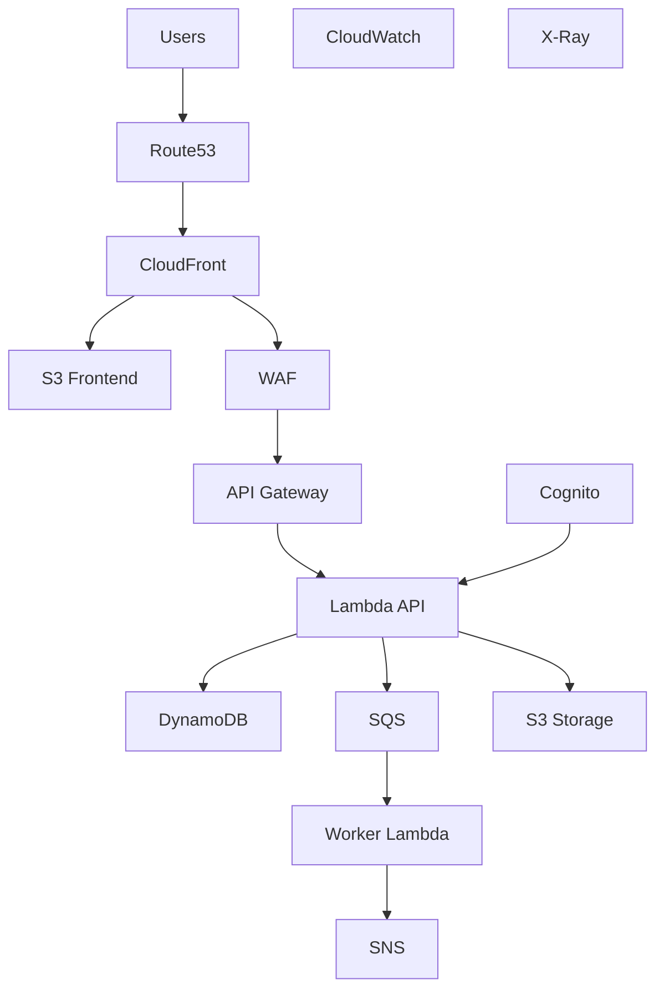

# AWS Customer Platform

## Architecture

```mermaid
flowchart TD

A[Users] --> B[Route53]
B --> C[CloudFront]
C --> D[S3 Frontend]

C --> E[WAF]
E --> F[API Gateway]

F --> G[Lambda API]

G --> H[DynamoDB]
G --> I[SQS]
I --> J[Worker Lambda]

J --> K[SNS]

G --> L[S3 Storage]

M[Cognito] --> G

N[CloudWatch]
O[X-Ray]
```
